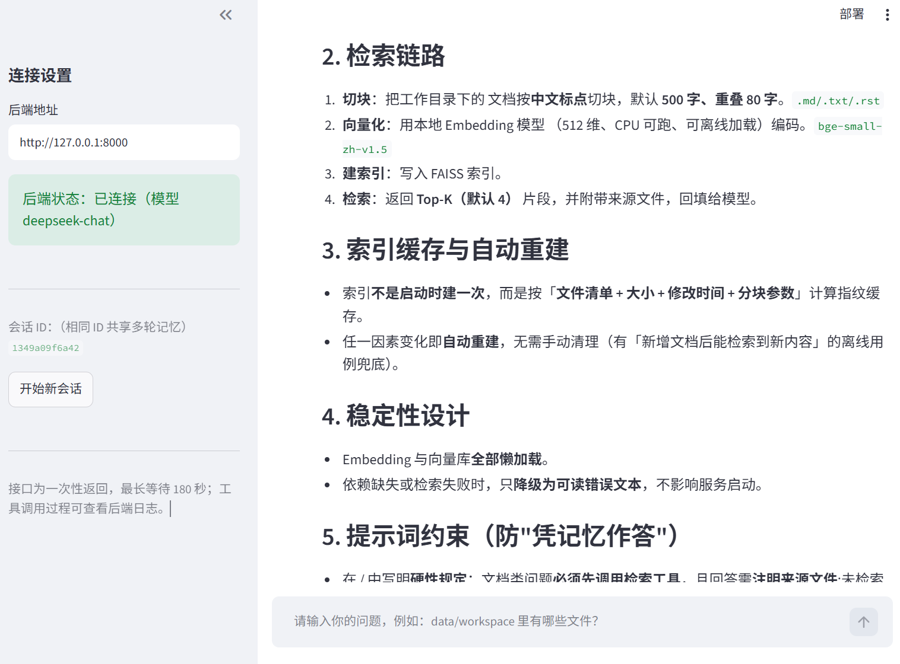

# AI 研发助手 Agent



> 前端界面基于 Streamlit 实现，图中展示了 Agent 走知识库语义检索（RAG）链路的过程与后端连接状态。

基于 **FastAPI + LangGraph + Streamlit** 的 AI 研发助手服务骨架：HTTP 接口 → 业务编排 → LangGraph 工作流（规划 / 工具调用 / 收尾）→ 大模型与工具，并附带一个中文聊天前端。

> **仓库地址（Gitee）**：<https://gitee.com/zhangsan220122/ai-agent>

## 项目简介

这是一个「能动手做事」的对话式研发助手：模型不只是聊天，而是通过 **Function Calling** 主动调用本机工具（列目录、读文件、语义检索项目文档、按需执行白名单命令），把工具结果回填给模型后再产出回答；所有工具访问都被限制在固定工作目录内，构成一层可解释的沙盒。

| 能力 | 说明 |
| --- | --- |
| Agent 工作流 | LangGraph `StateGraph` 编排 `planner → agent ⇄ tools → finalize`，条件边按最大步数收口，不会无限循环 |
| 工具调用 | 用 `bind_tools` 绑定工具，自动解析 `tool_calls`、执行后按 `tool_call_id` 回填 `ToolMessage` |
| 知识库检索（RAG） | 项目文档切分 → 本地 Embedding 向量化 → FAISS 语义检索；文档类问题先检索片段再作答，索引按文件指纹自动重建 |
| 多轮记忆 | checkpointer 以 `thread_id = session_id` 保存上下文，同一会话可连续追问 |
| 双形态接口 | 一次性返回 `POST /api/v1/chat` + SSE 逐字流式 `POST /api/v1/chat/stream` |
| 沙盒安全 | 工具只能访问 `data/workspace`，拦截 `../` 路径穿越；命令行工具默认关闭且仅限白名单 |
| 聊天前端 | Streamlit 中文气泡聊天页，可切换后端地址、查看连接状态与执行计划 |
| 可测试性 | 41 个离线 pytest 用例（假模型驱动，不需要 API Key、不访问网络） |

典型用法：问一句「data/workspace 里有哪些文件？」或「读一下 README.md 前 50 行」，Agent 会自己决定调用哪个工具、拿到结果后再回答；问文档类问题（如「这个项目怎么启动？」）时会先走**知识库语义检索**，而不是把整篇 README 读进来。

## 技术栈

**核心三件套：FastAPI（HTTP 接口）＋ LangGraph（Agent 工作流编排）＋ Streamlit（聊天前端）。**

其余依赖如下：

| 组件 | 版本 | 用途 |
| --- | --- | --- |
| langchain | 1.4.3 | LLM 应用框架 |
| langchain-openai | 1.6.6 | OpenAI 兼容模型接入 |
| langgraph | 1.2.12 | Agent 工作流编排（含 checkpointer） |
| langchain-community | 0.4.2 | 文本切分 + FAISS 向量库适配（RAG 检索用） |
| faiss-cpu | 1.15.1 | 本地向量索引（CPU 版，无需 GPU） |
| sentence-transformers | 6.1.0 | 本地 Embedding 模型（离线把文本转成向量） |
| fastapi | 0.142.1 | HTTP 接口 |
| uvicorn | 0.54.0 | ASGI 服务器 |
| pydantic | 2.13.5 | 数据契约与校验 |
| python-dotenv | 1.2.3 | .env 配置加载 |
| streamlit | 1.64.0 | 聊天前端界面（`frontend/app.py`） |
| requests | 2.34.2 | 前端调用后端 HTTP 接口 |
| ruff | 0.16.9 | 静态检查 + 格式化（开发依赖） |
| pyright | 1.1.414 | 类型检查，与 VS Code 的 Pylance 同源（开发依赖） |

- Python 要求：**>= 3.10**（本机为 Python 3.10.0）
- 依赖清单见 `requirements.txt`，开发/测试依赖见 `requirements-dev.txt`

## 目录结构

```
ai-agent/
├── app/
│   ├── main.py                 # FastAPI 应用入口（create_app + lifespan）
│   ├── core/                   # 配置与日志
│   │   ├── config.py           # Settings / get_settings()
│   │   └── logging.py          # setup_logging / get_logger
│   ├── api/
│   │   ├── deps.py             # 依赖注入（配置、AgentService 单例）
│   │   └── v1/
│   │       ├── router.py       # /api/v1 路由汇总
│   │       └── endpoints/
│   │           ├── health.py   # /health、/ready
│   │           └── chat.py     # /chat、/chat/stream(SSE)
│   ├── agents/                 # LangGraph 工作流
│   │   ├── state.py            # AgentState（messages 使用 add_messages）
│   │   ├── nodes.py            # planner / agent / tools / finalize 节点工厂
│   │   ├── graph.py            # 图组装与编译
│   │   └── tools/
│   │       ├── registry.py     # 工具注册表
│   │       ├── file_ops.py     # 列目录 / 读文件（限定工作目录）
│   │       ├── shell.py        # 白名单命令，默认关闭
│   │       └── knowledge.py    # 知识库语义检索（RAG：本地 Embedding + FAISS）
│   ├── llm/factory.py          # ChatOpenAI 工厂（唯一模型实例化入口）
│   ├── memory/checkpointer.py  # 会话记忆（默认内存）
│   ├── schemas/chat.py         # 请求/响应模型
│   └── services/agent_service.py  # 业务编排：chat / stream
├── frontend/
│   └── app.py                  # Streamlit 聊天界面（调用 /api/v1/chat）
├── scripts/
│   ├── cli.py                  # 命令行调试
│   ├── check_env.py            # 依赖体检（仅标准库，供 run_dev.ps1 调用）
│   └── run_dev.ps1             # Windows 一键启动（自动选解释器 + 端口预检 + -Diagnose 体检）
├── tests/                      # pytest 用例（离线，不访问网络）
├── data/workspace/             # 工具可访问的工作目录（运行时创建）
├── requirements.txt / requirements-dev.txt
├── .env.example
└── pyproject.toml              # pytest / ruff / pyright 配置
```

**依赖方向（单向，禁止反向 import）**：`api → services → agents → llm / agents.tools`；`core`、`schemas` 为横切能力。

## 快速开始

```powershell
# 0) 克隆仓库（已下载源码可跳过）
git clone https://gitee.com/zhangsan220122/ai-agent.git
cd ai-agent

# 1) 创建虚拟环境（建议显式指定 3.10，避免命中 Microsoft Store 的 python 占位程序）
py -3.10 -m venv .venv
.\.venv\Scripts\Activate.ps1

# 2) 升级 pip 并安装依赖（本机 pip 为 21.2.3，建议先升级）
python -m pip install --upgrade pip
python -m pip install -r requirements.txt

# 3) 配置环境变量
Copy-Item .env.example .env      # 然后填写 OPENAI_API_KEY

# 4) 启动（三种等价方式，任选其一）
#    a) 项目脚本（推荐：自动选解释器 + 端口占用预检 + 环境体检）
powershell -ExecutionPolicy Bypass -File scripts\run_dev.ps1

#    b) 先激活虚拟环境，再用 python
.\.venv\Scripts\Activate.ps1
python -m uvicorn app.main:app --reload

#    c) 不激活虚拟环境，直接指定解释器
.\.venv\Scripts\python.exe -m uvicorn app.main:app --reload
```

- 只想体检不启动：`powershell -ExecutionPolicy Bypass -File scripts\run_dev.ps1 -Diagnose`
- 端口冲突或想换端口：`... -Port 8080`；不要热重载：`... -NoReload`
- 接口文档：<http://127.0.0.1:8000/docs>
- 命令行调试：`.\.venv\Scripts\python.exe scripts\cli.py "data/workspace 里有哪些文件"`

> 内网/代理环境若直连 PyPI 超时，可改用镜像源，例如
> `python -m pip install -r requirements.txt -i https://pypi.tuna.tsinghua.edu.cn/simple`

## 本地启动（两个终端）

后端与前端是两个独立进程，**分别开两个终端**即可（前端依赖后端，请先起后端）：

| 终端 | 进程 | 端口 | 地址 |
| --- | --- | --- | --- |
| 终端 1 | 后端 API（uvicorn + FastAPI） | 8000 | <http://127.0.0.1:8000> |
| 终端 2 | 前端页面（Streamlit） | 8501 | <http://localhost:8501> |

### 终端 1：启动后端（uvicorn）

```powershell
cd C:\path\to\ai-agent

# 推荐：激活虚拟环境后用 python 启动
.\.venv\Scripts\Activate.ps1
python -m uvicorn app.main:app --reload

# 或者：不激活虚拟环境，直接指定解释器
.\.venv\Scripts\python.exe -m uvicorn app.main:app --reload
```

看到下面两行说明后端已就绪：

```text
INFO:     Uvicorn running on http://127.0.0.1:8000 (Press CTRL+C to quit)
INFO:     Application startup complete.
```

- 接口文档：<http://127.0.0.1:8000/docs>
- 存活 / 就绪检查：<http://127.0.0.1:8000/api/v1/health>、<http://127.0.0.1:8000/api/v1/ready>
- **这个终端不要关**：工具调用、规划、错误的日志都在这里输出，排查问题时最先看它。
- 只想换端口：追加 `--port 8080`；不想热重载：去掉 `--reload`。

### 终端 2：启动前端（Streamlit）

**另开一个终端**，执行：

```powershell
cd C:\path\to\ai-agent
.\.venv\Scripts\python.exe -m streamlit run frontend/app.py
```

浏览器会自动打开 <http://localhost:8501>；换端口用 `--server.port 8502`。

- 侧边栏应显示「后端状态：已连接」；若显示「未连接」，说明终端 1 未启动或地址/端口不一致。
- 在输入框问一句 **`data/workspace 里有哪些文件？`** 验证链路：助手气泡会给出回答，展开「执行计划」还能看到 `plan` / `steps` / 模型名。

> `.env` 未填 `OPENAI_API_KEY` 时，两个服务都能正常启动，但对话会返回 **503**（`/api/v1/ready` 显示 `degraded`）——这是有意的降级设计，不是启动失败。

### 一键启动（可选）

不想开两个终端时，也可以先跑后端脚本，再手动起前端：

```powershell
# 终端 1：项目脚本（自动优先 .venv 解释器 + 端口占用预检 + 可选体检）
powershell -ExecutionPolicy Bypass -File scripts\run_dev.ps1
```

### 启动失败排查（Windows）

**症状：执行 `python -m uvicorn app.main:app --reload` 后既没有报错、也没有任何输出，命令直接退出。**

原因：`python` 命中的是 **Microsoft Store 的应用执行别名占位程序**
（`C:\Users\<你>\AppData\Local\Microsoft\WindowsApps\python.exe`），
它被调用时不会输出任何内容也不会报错，因此看起来像“启动失败”。
用 `where python` 可以确认；改用下面任一方式即可：

| 方式 | 命令 |
| --- | --- |
| 项目脚本（推荐） | `powershell -ExecutionPolicy Bypass -File scripts\run_dev.ps1` |
| 激活虚拟环境 | `.\.venv\Scripts\Activate.ps1` 然后 `python -m uvicorn app.main:app --reload` |
| 解释器绝对路径 | `.\.venv\Scripts\python.exe -m uvicorn app.main:app --reload` |

> 注意：本机 `py -3.10` 指向系统 Python 3.10（`...\Programs\Python\Python310`），
> 它**没有安装项目依赖**，直接 `py -3.10 -m uvicorn` 会报 `ModuleNotFoundError`；
> 请在 `.venv` 中安装依赖并使用 venv 解释器。

其他常见问题：

- **端口被占用**：`run_dev.ps1` 会先检测并打印占用进程 PID；也可换端口
  `... -Port 8080`，或 `taskkill /T /F /PID <PID>`。
- **`--reload` 日志显示 `using StatReload`**：未安装 `watchfiles` 时的正常回退
  （改用轮询扫描），服务功能不受影响；想要更灵敏的热重载可
  `python -m pip install watchfiles`。
- **接口返回 503**：`.env` 未填写 `OPENAI_API_KEY`；`/api/v1/ready` 会返回 `degraded`。
- **一键体检**：`powershell -ExecutionPolicy Bypass -File scripts\run_dev.ps1 -Diagnose`
  （解释器、依赖版本、端口、`.env` 配置一次性列出，不会启动服务）。

## 聊天前端（Streamlit）

不想用 Swagger 的话，可以直接开一个中文气泡聊天页面（**两终端的完整步骤见上文「本地启动（两个终端）」**）：

```powershell
# 终端 A：先启动后端（默认 127.0.0.1:8000）
powershell -ExecutionPolicy Bypass -File scripts\run_dev.ps1

# 终端 B：启动前端，浏览器会自动打开 http://localhost:8501
.\.venv\Scripts\python.exe -m streamlit run frontend/app.py
```

- 页面顶部标题「AI 研发助手」，用 `st.chat_input` + `st.chat_message` 实现气泡聊天；
- 提交后前端请求 `POST /api/v1/chat`，把响应中的 `answer` 渲染到助手气泡；
- 侧边栏可修改后端地址、查看后端状态（读 `/api/v1/ready`）、点「开始新会话」更换 `session_id`（决定多轮记忆分组）；
- 助手气泡可展开「执行计划」，查看 `plan` / `steps` / 模型名；
- 前端在 Streamlit 进程里用 `requests` 调用后端，属于服务端请求，不依赖后端 CORS 配置；
- 换端口启动前端：`.\.venv\Scripts\python.exe -m streamlit run frontend/app.py --server.port 8502`
- 常见报错：侧边栏显示「未连接」= 后端没起来；对话气泡提示 503 = `.env` 里没填 `OPENAI_API_KEY`。

## 接口一览

| 方法 | 路径 | 说明 |
| --- | --- | --- |
| POST | `/api/v1/chat` | 执行一轮 Agent 对话，返回完整回答 |
| POST | `/api/v1/chat/stream` | SSE 流式返回：`start` / `progress` / `token` / `end` / `error` |
| GET | `/api/v1/health` | 存活检查 |
| GET | `/api/v1/ready` | 就绪检查（校验模型凭据是否配置） |
| GET | `/` | 服务信息 |

```powershell
# 非流式
Invoke-RestMethod -Method Post http://127.0.0.1:8000/api/v1/chat `
  -ContentType "application/json" `
  -Body '{"message":"帮我看看项目里有哪些文件","session_id":"demo"}'
```

## 工作流

```
START -> planner -> agent -+-> tools -> agent   (循环，最多 MAX_AGENT_STEPS 轮)
                           +-> finalize -> END
```

- `planner`：生成简短计划（失败自动降级，不阻塞主流程）
- `agent`：带工具绑定的模型推理，产出回答或 `tool_calls`
- `tools`：逐个执行工具并回填 `ToolMessage`（未注册工具、执行异常都会转成可读文本回填）
- `finalize`：基于完整上下文生成最终回答
- 达到步数上限时强制进入 `finalize`：悬空的 `tool_calls` 会**从图状态中移除**（`RemoveMessage`），
  并在收尾提示词里降级成一段文本说明。两者都要做——只降级提示词的话，同一 `thread_id`
  续聊时会把“assistant 带 tool_calls 但没有 tool 结果”的非法序列重放给模型（OpenAI 返回 400）

同一 `session_id` 复用同一 `thread_id`，因此天然具备多轮记忆。

## 知识库检索（RAG）

文档类问题（怎么启动、有哪些功能、怎么配置、架构如何）如果让模型直接 `read_project_file` 把整篇 README 读进来，
既浪费上下文，又容易漏掉散落在多篇文档里的答案。因此项目内置了 `search_knowledge_base` 工具，
并在系统提示词中写明**硬性规定**：文档类问题必须先检索、再作答；未检索时禁止直接读 `README.md` / `PROJECT_SUMMARY.md` / `docs/`。

工作方式：

1. 扫描 `KNOWLEDGE_DIRS`（默认项目根目录）下的 `.md` / `.txt` / `.rst` 文档，跳过 `.venv` / `.git` / `data` 等目录与超过 512 KB 的文件；
2. 用 `RecursiveCharacterTextSplitter` 按中文标点切块（默认 500 字、重叠 80 字，避免把整句切碎）；
3. 用本地 Embedding 模型（默认 `BAAI/bge-small-zh-v1.5`，CPU 即可运行）把片段向量化，构建 FAISS 索引；
4. 检索问题 → 取最相关的 `KNOWLEDGE_TOP_K` 个片段（默认 4）→ 连同来源文件一起回填给模型；
5. 索引按「文件清单 + 大小 + 修改时间 + 分块参数」指纹缓存在进程内，**文档改了就自动重建**，不需要手动清理。

相关配置（见 `.env.example`）：

| 变量 | 默认值 | 说明 |
| --- | --- | --- |
| `ENABLE_RAG_TOOL` | `true` | 是否注册 `search_knowledge_base`；关闭后模型看不到该工具 |
| `EMBEDDING_MODEL` | 留空自动探测 | 可填 HuggingFace 模型名，也可填**本地模型目录**（离线可用） |
| `KNOWLEDGE_DIRS` | `.` | 参与索引的目录（多个用英文逗号分隔） |
| `KNOWLEDGE_CHUNK_SIZE` / `KNOWLEDGE_CHUNK_OVERLAP` | `500` / `80` | 分块大小与重叠字数 |
| `KNOWLEDGE_TOP_K` | `4` | 默认返回片段数（模型调用时也可传 `top_k`） |
| `KNOWLEDGE_MAX_CHARS` | `1200` | 单个片段最多回填的字符数 |

> `EMBEDDING_MODEL` 留空时的探测顺序：先看本机缓存目录 `~/.cache/ai-agent/models/bge-small-zh-v1.5`
> （存在即直接使用，完全离线），否则用 `BAAI/bge-small-zh-v1.5`（首次使用时联网下载权重）。
> **模型或依赖不可用时不会中断服务**：工具返回 `错误: 知识库检索不可用...` 文本，
> 模型据此改用文件工具继续回答，对话不会 500。

### 怎么验证「真的走了 RAG」

前提：后端在自己的终端里运行（uvicorn 日志打在**终端 1**）。启动时先确认工具已注册：

```text
INFO  app.agents.graph | Agent 图已编译：tools=['list_project_files', 'read_project_file', 'search_knowledge_base'] max_agent_steps=6
```

再问一个文档类问题：

```powershell
Invoke-RestMethod -Method Post http://127.0.0.1:8000/api/v1/chat `
  -ContentType "application/json" `
  -Body '{"message":"这个项目怎么启动？","session_id":"rag-demo"}'
```

**终端 1 应出现下面几行（关键证据）**：

```text
INFO  app.agents.nodes            | 第 1 步请求工具：['search_knowledge_base']   # 而不是 read_project_file
INFO  app.agents.tools.knowledge  | 知识库索引已构建：文件=… 分块=… 模型=…       # 首次提问会建索引
INFO  app.agents.tools.knowledge  | search_knowledge_base 命中 4 段：query='这个项目怎么启动？' 来源=[…]
```

判断标准：

- `第 N 步请求工具：` 里出现 `search_knowledge_base`，且本轮的 `... 请求工具` 日志里没有紧随其后的 `read_project_file` 读取 `README.md`；
- 同一会话追问一句文档类问题，仍会看到检索日志（系统提示词每轮都在生效）；
- 回答里会带来源依据（工具回填的片段以 `[片段 1] 来源: …（第 N 块）` 形式给出）；
- 想跳过模型单独验证检索本身：`.\.venv\Scripts\python.exe scripts\cli.py "这个项目怎么启动"`，
  或只跑该工具的离线用例 `.\.venv\Scripts\python.exe -m pytest tests\test_knowledge_tool.py -q`。

## 扩展点

| 需求 | 改动位置 |
| --- | --- |
| 新增工具 | 在 `app/agents/tools/` 加一个 `@tool` 函数，然后在 `registry.get_tools()` 注册 |
| 调整知识库 / 检索参数 | 改 `.env` 的 `ENABLE_RAG_TOOL` / `EMBEDDING_MODEL` / `KNOWLEDGE_*`；实现见 `app/agents/tools/knowledge.py` |
| 改提示词（含「文档类问题先检索」硬性规定） | `app/agents/nodes.py` 的 `DEFAULT_SYSTEM_PROMPT`、`PLANNER_PROMPT` |
| 换模型/网关 | 改 `.env`（`OPENAI_MODEL` / `OPENAI_BASE_URL`），或在 `app/llm/factory.py` 调整参数 |
| 换会话存储 | 改 `app/memory/checkpointer.py`（如 `SqliteSaver` / `PostgresSaver`，需额外安装对应包） |
| 调整节点/流程 | `app/agents/nodes.py`、`app/agents/graph.py` |
| 新增接口 | 在 `app/api/v1/endpoints/` 加路由并注册到 `router.py` |

## 测试

```powershell
python -m pip install -r requirements-dev.txt
python -m pytest
```

测试用假模型 / 假图驱动，**不需要 API Key，也不访问网络**：

- `tests/test_health.py`：接口与缺配置时的 503 语义
- `tests/test_graph.py`：工具调用闭环、步数上限、多轮记忆
- `tests/test_tools.py`：路径越界防护、读取截断、命令白名单
- `tests/test_agent_service.py`：结果映射与 SSE 事件序列
- `tests/test_frontend.py`：前端的请求构造、响应解析与错误语义（monkeypatch 掉 `requests`）
- `tests/test_knowledge_tool.py`：知识库检索的相关性排序与 top_k 限制、空库降级为可读错误、文档变更后索引自动重建、`ENABLE_RAG_TOOL` 开关、系统提示词硬性规定回归、图端到端执行检索工具（用假 Embedding，不下载模型）

## 代码质量（静态检查）

仓库内置 Ruff（lint + 格式化）与 Pyright（类型检查）配置，提交前请确认下列命令均为**零输出**：

```powershell
.\.venv\Scripts\python.exe -m ruff check .            # 未使用导入 / 未定义名称 / 导入顺序…
.\.venv\Scripts\python.exe -m ruff format --check .   # 格式一致性（去掉 --check 即自动重排）
.\.venv\Scripts\python.exe -m pyright                 # 类型检查（与 VS Code 的 Pylance 同源）
```

- 规则与编辑器共用 `pyproject.toml` 的 `[tool.ruff]` / `[tool.pyright]`，不会出现“命令行干净、编辑器报警”的偏差；
- Ruff：行宽 100、目标 py310；Pyright：`standard` 模式（LangChain / LangGraph 动态类型较多，`strict` 会产生大量噪音）；
- 工具随开发依赖安装：`python -m pip install -r requirements-dev.txt`；
- Pyright 的 pip 包装器首次运行会经 nodeenv 下载 Node；离线或代理环境先复用系统 Node：
  `$env:PYRIGHT_PYTHON_GLOBAL_NODE='1'; python -m pyright`；
- VS Code 打开本项目时，`.vscode/settings.json`（已在 `.gitignore` 中）会把解释器指向 `.venv` 并开启 `standard` 类型检查；
  若 Problems 面板仍有历史告警，用 `Ctrl+Shift+P` → “Python: Select Interpreter” 选择 `\.venv\Scripts\python.exe` 即可。

## 注意事项与已知限制

1. 未配置 `OPENAI_API_KEY` 时服务仍可启动，`/api/v1/chat` 返回 **503**，`/api/v1/ready` 返回 `degraded`。
2. 默认 checkpointer 为**进程内内存**，重启即丢失、多副本不共享；生产请替换为持久化实现。
3. `read_project_file` / `list_project_files` 只能访问 `WORKSPACE_DIR`（默认 `data/workspace`）内部。
4. `run_whitelisted_command` 默认关闭；即便开启，也只允许 `python / pytest / ruff / mypy / git` 且禁用 shell 元字符、强制超时。
5. `search_knowledge_base` **只做只读检索**（不写任何磁盘文件）；索引对象缓存在进程内，应用重启后首次提问会重建；Embedding 模型首次使用时才加载，离线环境请提前缓存权重或用 `EMBEDDING_MODEL` 指向本地模型目录。
6. RAG 依赖（`faiss-cpu` / `sentence-transformers`）或模型不可用时，工具返回 `错误: ...` 文本而不是抛异常——服务照常运行、对话不会 500，模型会改用文件工具继续回答。
7. Windows 上 `python` 可能是 Microsoft Store 占位程序（表现为“无输出、直接退出”）：
   推荐用 `scripts\run_dev.ps1`（自动优先 `.venv` 解释器）或直接指定 `.\.venv\Scripts\python.exe`。
   详见「启动失败排查（Windows）」。

---

## 开发方式

本项目采用 Cline + DeepSeek 作为主要开发方式。
